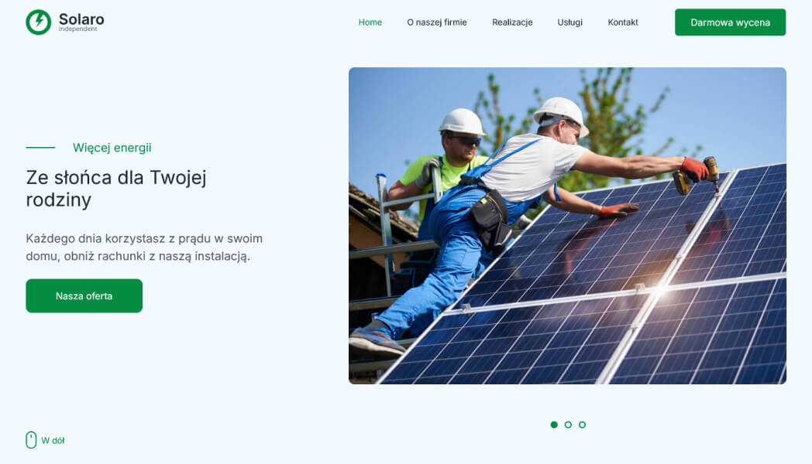

## Solaro
### Photovoltaics Website
###### Year: 2024

HTML5 / SCSS / BOOTSTRAP

**Solaro -** An interesting template for photovoltaic company, where they can present their offer. Customer opinions, offer of work performed, slider, interesting icons, links to social media and much more. Bright as the sun, :sunny: transparent as solar energy. :zap:

:poland:
**Solaro -** Ciekawy szablon dla branży fotowoltaicznej, w której mogą przedstawić swoją ofertę. Opinie klientów, oferta wykonywanych prac, slider, ciekawe ikony, linki do social media i wiele innych. Jasny jak słońce, :sunny: przejrzysty jak energia słoneczna. :zap:

### :tada: [Live](https://damiankoduje.pl/templates/solaro)

### Credits:
- [Bootstrap](https://getbootstrap.com)
- [Freepik](https://freepik.com)
- [Inter](https://fonts.google.com/specimen/Inter)
- [Swiper](https://swiperjs.com)
- [AOS](https://michalsnik.github.io/aos)
- [moveTo](https://hsnaydd.github.io/moveTo)

### Design by [Artbart](https://www.behance.net/artbart)
### :hand: Template created by [Damiankoduje.pl](https://damiankoduje.pl)